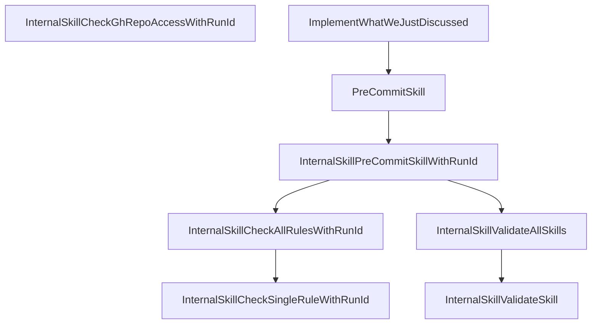

# Visualization and Topology

This file lives at `.ai/VIZ.md`, under the `.ai/` directory in the root of the repo. It contains exactly the full list of the skills in this repository and a complete list of what skill can invoke what other skill: every skill and every invocation relationship in the repo is listed here, and everything listed here is actually present in the repo.

## Skills

| Skill | Description |
|---|---|
| [`InternalSkillValidateSkill`](../.skills/InternalSkillValidateSkill/SKILL.md) | Meta-skill that validates another skill in this repository against `.ai/RULES.md`. |
| [`InternalSkillValidateAllSkills`](../.skills/InternalSkillValidateAllSkills/SKILL.md) | Meta-skill that validates every skill in this repository against `.ai/RULES.md`, by invoking `InternalSkillValidateSkill` once per skill and then performing the whole-repo checks. |
| [`InternalSkillCheckSingleRuleWithRunId`](../.skills/InternalSkillCheckSingleRuleWithRunId/SKILL.md) | Meta-skill that checks a single directory rule against its scoped files, with caching per `.ai/CACHING.md`. |
| [`InternalSkillCheckAllRulesWithRunId`](../.skills/InternalSkillCheckAllRulesWithRunId/SKILL.md) | Meta-skill that checks all directory rules listed in `ai-rules.yml` by invoking `InternalSkillCheckSingleRuleWithRunId` once per rule in parallel. |
| [`InternalSkillPreCommitSkillWithRunId`](../.skills/InternalSkillPreCommitSkillWithRunId/SKILL.md) | Meta-skill that performs the pre-commit gate under a caller-supplied `SkillRunId`: receipt-hygiene checks, directory rules via `InternalSkillCheckAllRulesWithRunId`, optional `PRECOMMIT.md` checks, then `InternalSkillValidateAllSkills` for full compliance. |
| [`PreCommitSkill`](../.skills/PreCommitSkill/SKILL.md) | Meta-skill that gates a commit to this repository: takes no parameters, generates a fresh `SkillRunId` in the default format, and delegates to `InternalSkillPreCommitSkillWithRunId`. |
| [`ImplementWhatWeJustDiscussed`](../.skills/ImplementWhatWeJustDiscussed/SKILL.md) | Summarizes the current conversation to extract the feature request, implements the feature with a design document, then invokes `PreCommitSkill` and iterates on any failures until all pre-commit checks pass. |
| [`InternalSkillCheckGhRepoAccessWithRunId`](../.skills/InternalSkillCheckGhRepoAccessWithRunId/SKILL.md) | Checks that the GitHub CLI (`gh`) is installed, authenticated, and can access the repository URL in `.ai/repo.txt`, and ensures the `theloop` label exists for bugs and pull requests. |

## SkillInvocations

| Invoker | Invokee |
|---|---|
| `PreCommitSkill` | `InternalSkillPreCommitSkillWithRunId` |
| `InternalSkillPreCommitSkillWithRunId` | `InternalSkillCheckAllRulesWithRunId` |
| `InternalSkillPreCommitSkillWithRunId` | `InternalSkillValidateAllSkills` |
| `InternalSkillCheckAllRulesWithRunId` | `InternalSkillCheckSingleRuleWithRunId` |
| `InternalSkillValidateAllSkills` | `InternalSkillValidateSkill` |
| `ImplementWhatWeJustDiscussed` | `PreCommitSkill` |

## Diagram

An arrow from A to B means skill A can, under some circumstances, invoke skill B.

