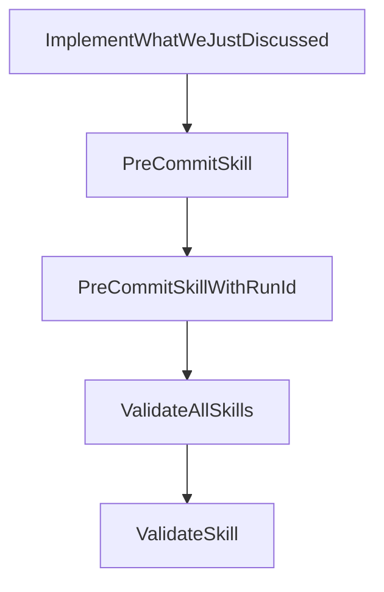

# Visualization and Topology

This file lives at `.ai/VIZ.md`, under the `.ai/` directory in the root of the repo. It contains exactly the full list of the skills in this repository and a complete list of what skill can invoke what other skill: every skill and every invocation relationship in the repo is listed here, and everything listed here is actually present in the repo.

## Skills

| Skill | Description |
|---|---|
| [`ValidateSkill`](../.skills/ValidateSkill/SKILL.md) | Meta-skill that validates another skill in this repository against `.ai/RULES.md`. |
| [`ValidateAllSkills`](../.skills/ValidateAllSkills/SKILL.md) | Meta-skill that validates every skill in this repository against `.ai/RULES.md`, by invoking `ValidateSkill` once per skill and then performing the whole-repo checks. |
| [`PreCommitSkillWithRunId`](../.skills/PreCommitSkillWithRunId/SKILL.md) | Meta-skill that performs the pre-commit gate under a caller-supplied `SkillRunId`: receipt-hygiene checks, directory invariants from `ai-invariants.yml` (stale ones in parallel, cached ones skipped), optional `PRECOMMIT.md` checks, then `ValidateAllSkills` for full compliance. |
| [`PreCommitSkill`](../.skills/PreCommitSkill/SKILL.md) | Meta-skill that gates a commit to this repository: takes no parameters, generates a fresh `SkillRunId` in the default format, and delegates to `PreCommitSkillWithRunId`. |
| [`ImplementWhatWeJustDiscussed`](../.skills/ImplementWhatWeJustDiscussed/SKILL.md) | Summarizes the current conversation to extract the feature request, implements the feature with a design document, then invokes `PreCommitSkill` and iterates on any failures until all pre-commit checks pass. |

## SkillInvocations

| Invoker | Invokee |
|---|---|
| `PreCommitSkill` | `PreCommitSkillWithRunId` |
| `PreCommitSkillWithRunId` | `ValidateAllSkills` |
| `ValidateAllSkills` | `ValidateSkill` |
| `ImplementWhatWeJustDiscussed` | `PreCommitSkill` |

## Diagram

An arrow from A to B means skill A can, under some circumstances, invoke skill B.

