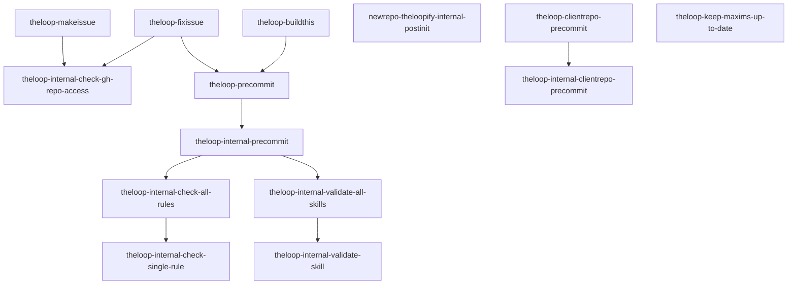

# Visualization and Topology

This file lives at `.theloop/VIZ.md`, under the `.theloop/` directory in the root of the repo. It contains exactly the full list of the skills in this repository and a complete list of what skill can invoke what other skill: every skill and every invocation relationship in the repo is listed here, and everything listed here is actually present in the repo.

## Skills

| Skill | Description |
|---|---|
| [`theloop-internal-validate-skill`](../.skills/theloop-internal-validate-skill/SKILL.md) | Meta-skill that validates another skill in this repository against `.theloop/SKILLS-META-RULES.md`. |
| [`theloop-internal-validate-all-skills`](../.skills/theloop-internal-validate-all-skills/SKILL.md) | Meta-skill that validates every skill in this repository against `.theloop/SKILLS-META-RULES.md`, by fanning out subagents to invoke `theloop-internal-validate-skill` once per skill and then performing the whole-repo checks. |
| [`theloop-internal-check-single-rule`](../.skills/theloop-internal-check-single-rule/SKILL.md) | Meta-skill that checks a single directory rule against its scoped files, with caching per `.theloop/CACHING.md`. |
| [`theloop-internal-check-all-rules`](../.skills/theloop-internal-check-all-rules/SKILL.md) | Meta-skill that checks all directory rules listed in `ai-rules.yml` by fanning out subagents to invoke `theloop-internal-check-single-rule` once per rule. |
| [`theloop-internal-precommit`](../.skills/theloop-internal-precommit/SKILL.md) | Meta-skill that performs the pre-commit gate under a caller-supplied `SkillRunId`: receipt-hygiene checks, directory rules via `theloop-internal-check-all-rules`, optional `PRECOMMIT.md` checks, then `theloop-internal-validate-all-skills` for full compliance. |
| [`theloop-precommit`](../.skills/theloop-precommit/SKILL.md) | Meta-skill that gates a commit to this repository: takes no parameters, generates a fresh `SkillRunId` in the default format, and delegates to `theloop-internal-precommit`. |
| [`theloop-buildthis`](../.skills/theloop-buildthis/SKILL.md) | Summarizes the current conversation to extract the feature request, implements the feature with a design document, then invokes `theloop-precommit` and iterates on any failures until all pre-commit checks pass. |
| [`theloop-internal-check-gh-repo-access`](../.skills/theloop-internal-check-gh-repo-access/SKILL.md) | Checks that the GitHub CLI (`gh`) is installed, authenticated, and can access the repository URL in `.theloop/repo.txt`, ensures Issues are enabled on the repository, and ensures the `theloop` label exists for bugs and pull requests. |
| [`theloop-makeissue`](../.skills/theloop-makeissue/SKILL.md) | Summarizes the current conversation into a feature specification, clarifies with the human until the picture is clear, then creates a GitHub issue tagged with `theloop`. |
| [`theloop-fixissue`](../.skills/theloop-fixissue/SKILL.md) | Implements a GitHub issue as a pull request: unique branch, feature implementation, `theloop-precommit`, commit, `theloop`-labeled PR, and issue journal comments. |
| [`newrepo-theloopify-internal-postinit`](../.skills/newrepo-theloopify-internal-postinit/SKILL.md) | One-time agentic setup for a theloop client repository: analyzes docs, tooling, and CI gates, authors a free-form `PRECOMMIT.md`, and flips the configuration gate. Installed in clients as `newrepo-theloopify-internal-postinit`. |
| [`theloop-clientrepo-precommit`](../.skills/theloop-clientrepo-precommit/SKILL.md) | Parameterless pre-commit gate for a theloop client repository: checks the configuration gate, generates a `SkillRunId`, and delegates to `theloop-internal-clientrepo-precommit`. Installed in clients as `theloop-precommit`. |
| [`theloop-internal-clientrepo-precommit`](../.skills/theloop-internal-clientrepo-precommit/SKILL.md) | Slim client-repo pre-commit gate under a caller-supplied `SkillRunId`: receipt hygiene plus the checks described in a free-form `PRECOMMIT.md`, with no directory rules or skill validation. |
| [`theloop-keep-maxims-up-to-date`](../.skills/theloop-keep-maxims-up-to-date/SKILL.md) | Distills a repository's unwritten engineering paradigms — its maxims — from merged pull-request history into per-topic `maxims/` files; takes no parameters and generates its own `SkillRunId`. Invokes no other skills. |

## SkillInvocations

| Invoker | Invokee |
|---|---|
| `theloop-precommit` | `theloop-internal-precommit` |
| `theloop-internal-precommit` | `theloop-internal-check-all-rules` |
| `theloop-internal-precommit` | `theloop-internal-validate-all-skills` |
| `theloop-internal-check-all-rules` | `theloop-internal-check-single-rule` |
| `theloop-internal-validate-all-skills` | `theloop-internal-validate-skill` |
| `theloop-buildthis` | `theloop-precommit` |
| `theloop-makeissue` | `theloop-internal-check-gh-repo-access` |
| `theloop-fixissue` | `theloop-internal-check-gh-repo-access` |
| `theloop-fixissue` | `theloop-precommit` |
| `theloop-clientrepo-precommit` | `theloop-internal-clientrepo-precommit` |

## Diagram

An arrow from A to B means skill A can, under some circumstances, invoke skill B.

