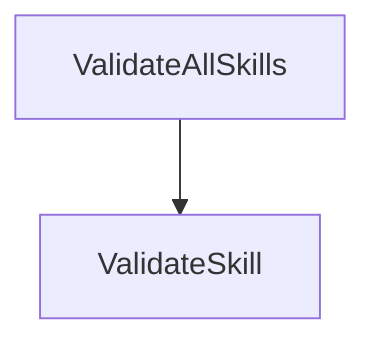

# Visualization and Topology

This file contains exactly the full list of the skills in this repository and a complete list of what skill can invoke what other skill: every skill and every invocation relationship in the repo is listed here, and everything listed here is actual in the repo.

## Skills

| Skill | Description |
|---|---|
| [`ValidateSkill`](.skills/ValidateSkill/SKILL.md) | Meta-skill that validates another skill in this repository against `RULES.md`. |
| [`ValidateAllSkills`](.skills/ValidateAllSkills/SKILL.md) | Meta-skill that validates every skill in this repository against `RULES.md`, by invoking `ValidateSkill` once per skill and then performing the whole-repo checks. |

## SkillInvocations

| Invoker | Invokee |
|---|---|
| `ValidateAllSkills` | `ValidateSkill` |

## Diagram

An arrow from A to B means skill A can, under some circumstances, invoke skill B.

